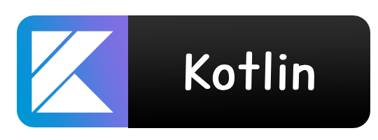

# About me

Hi, I'm [LAPIERRE Yohan](https://github.com/LapierreYohan), I'am 20 year old and I'm a French developer passionate about IT. I learn a lot of things on my own and in my current training .I am in university bachelors of technology at the university institute of technology of Lyon 1. 

[Portfolio](https://lapierreyohan.github.io/#)

# Project 

```yaml
Current projet :

 - NeoTeams :  Advanced Manage Discord Bot for your Guild or Faction.
 - Applications for Teams : Crossplatform application to change data from NeoTeams Database.
 - NeoTeams API : An API to centralise all data to communicate with Flutter Application Crossplatform
 
Learning :

 - Spring Boot (Java)
 - OpenPDF (Java)
 - RPGLE
 - Flutter
 - Kotlin
 - Discord.js V14
```

# Languages already used

<div align="center" style="margin-left: 25px; margin-right: 25px;">
  
  
  
  
  
  
  
  
  
  
  
</div>


# Contact

 - Student Email : yohan.lapierre@etu.univ-lyon1.fr
 - Private Email : lapierre.yohan.69@gmail.com

# GitHub Stats

</br>
<p style="text-align:center;", align="center">
  
</p>
<p align="center">
  
</p>
